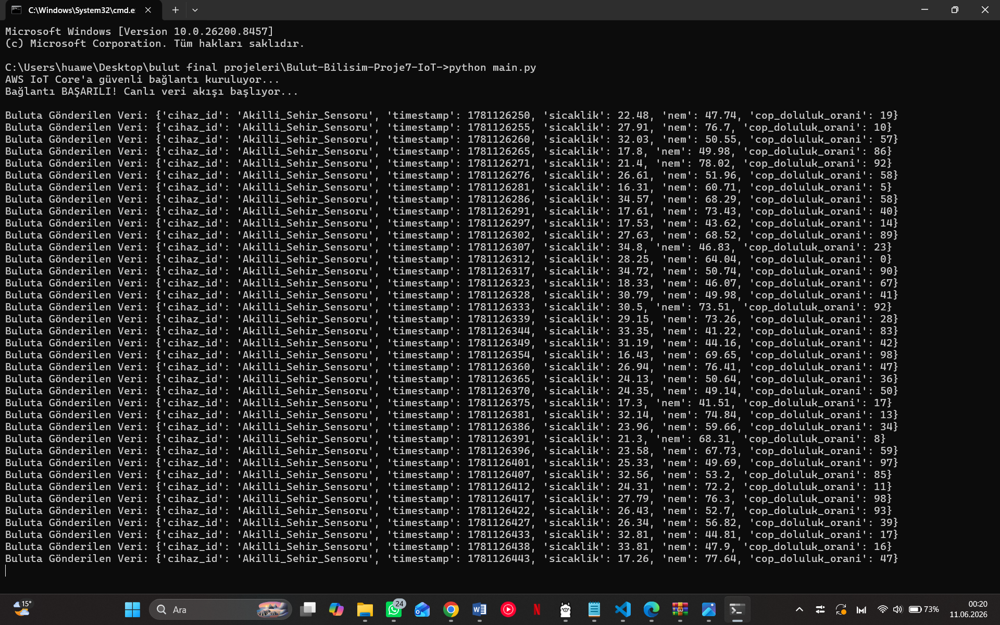
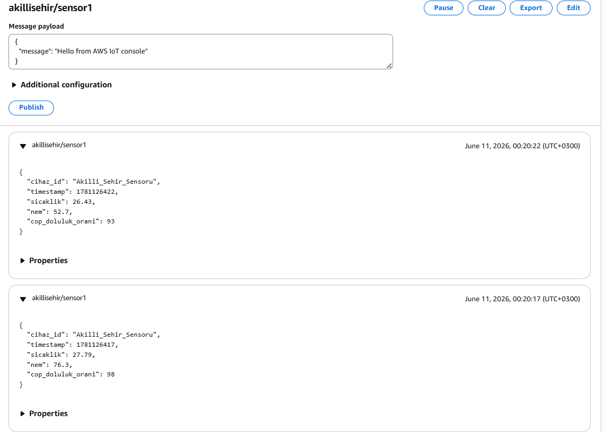

# Proje 7: IoT ve Akıllı Şehir Uygulaması

## 1. Projenin Amacı ve Kapsamı
Bu projenin amacı, bir akıllı şehir senaryosunda çevreye konumlandırılmış IoT (Nesnelerin İnterneti) cihazlarının/sensörlerinin simüle edilmesi ve bu sensörlerden elde edilen anlık verilerin bulut mimarisi üzerinde güvenli, ölçeklenebilir ve gerçek zamanlı olarak işlenmesini sağlamaktır. 

Proje kapsamında, lokal bir bilgisayar üzerinde çalışacak Python tabanlı simülatör, bir akıllı şehrin sokak lambası, çöp kutusu doluluk oranı ve çevre sıcaklık/nem sensörleri gibi davranacaktır. Üretilen bu anlamlı veriler, MQTT protokolü kullanılarak güvenli bir şekilde AWS IoT Core ortamına aktarılacak, burada tetiklenen AWS Lambda fonksiyonu vasıtasıyla işlenerek depolama katmanına ilesitecektir. Bu çalışma; veri toplama, kuyruğa alma, sunucusuz (serverless) mimari ile veri işleme ve bulut tabanlı izleme süreçlerinin temel mekanizmalarını öğrenmek amacıyla kurgulanmıştır.

## 2. Sistem Mimarisi
Projenin uçtan uca veri akışı ve mimari yapısı aşağıdaki akış şemasına uygun olarak tasarlanmıştır:

```text
+------------------------------------+       MQTT (Secure)       +------------------------+
|                                    | ------------------------> |                        |
|   Lokal Python Script (Sensör)    |                           |   AWS IoT Core (Broker)   |
|  (Sıcaklık, Nem, Doluluk Verisi)   | <------------------------ |                        |
+------------------------------------+                           +------------------------+
                                                                             |
                                                                             | Message Routing / Rule
                                                                             v
+------------------------------------+                           +------------------------+
|                                    |                           |                        |
|   Veritabanı (Depolama Katmanı)    | <------------------------ |  AWS Lambda (Function) |
|      (DynamoDB / PostgreSQL)       |                           |  (Veri Ayrıştırma/Log) |
|                                    |                           |                        |
+------------------------------------+                           +------------------------+

### 2. Gün Geliştirmeleri (AWS Altyapısının Kurulması):
* AWS IoT Core servisi üzerinde 'Akilli_Sehir_Sensoru' adında sanal bir nesne (Thing) tanımlandı.
* Cihazın buluta veri gönderirken kullanacağı güvenlik katmanı için 'Akilli_Sehir_Politikasi' adında bir IoT Policy oluşturuldu; `iot:*` aksiyonları ve `*` kaynakları için "Allow" (İzin ver) kuralı tanımlanarak nesneye bağlandı.
* Cihazın bulut mimarisiyle şifreli ve güvenli haberleşebilmesi için gerekli olan X.509 standartlarındaki Device Certificate, Private Key ve Amazon Root CA 1 dosyaları başarıyla üretilerek yerel ortamda projenin `certs/` dizinine güvenli bir şekilde taşındı.

### 2. Gün Görsel Kanıtları:
* **Görsel 3: AWS IoT Core Üzerinde Oluşturulan Akilli_Sehir_Sensoru Nesnesi (Thing)**
  

* **Görsel 4: AWS IoT Core Üzerinde Güvenlik Yetkilendirmeleri Tanımlanan Akilli_Sehir_Politikasi (Policy)**
  


## 3. GÜN: Python ile MQTT Bağlantısının Sağlanması ve Canlı Veri Akışı

Bu aşamada, yerel simülasyon ortamı ile AWS bulut altyapısı arasında güvenli haberleşme köprüsü kurulmuştur.

### Yapılan İşlemler:
1. **SDK Kurulumu:** Python ortamında AWS IoT servisleri ile konuşabilmek adına `AWSIoTPythonSDK` kütüphanesi entegre edilmiştir.
2. **Endpoint Tanımlaması:** AWS IoT Core panelinden projeye özel "Data Endpoint" adresi alınarak simülasyon koduna eklenmiştir.
3. **Simülasyon Kodunun Geliştirilmesi (`main.py`):** Akıllı şehir senaryosuna uygun olarak rastgele sıcaklık, nem ve akıllı çöp kutusu doluluk oranları üreten ve bunları JSON formatına çeviren bir Python scripti yazılmıştır.
4. **Güvenli MQTT Bağlantısı:** X.509 sertifikaları ve özel anahtarlar kullanılarak Port 8883 üzerinden AWS bulutuna saniyede bir veri yayını (Publish) başarıyla başlatılmıştır. Bulut tarafında `akillisehir/sensor1` konusu (Topic) üzerinden veriler anlık olarak doğrulanmıştır.


### 3. Gün Görsel Kanıtları:

* **Görsel 6: Python Scripti Üzerinden Anlık Telemetri Veri Akışı (Yerel Terminal)** 
* **Görsel 7: AWS IoT Core MQTT Test Client Canlı Veri Takibi - Ekran 1 (Bulut Paneli)** 
* **Görsel 8: AWS IoT Core MQTT Test Client Canlı Veri Takibi - Ekran 2 (Bulut Paneli)** .png)